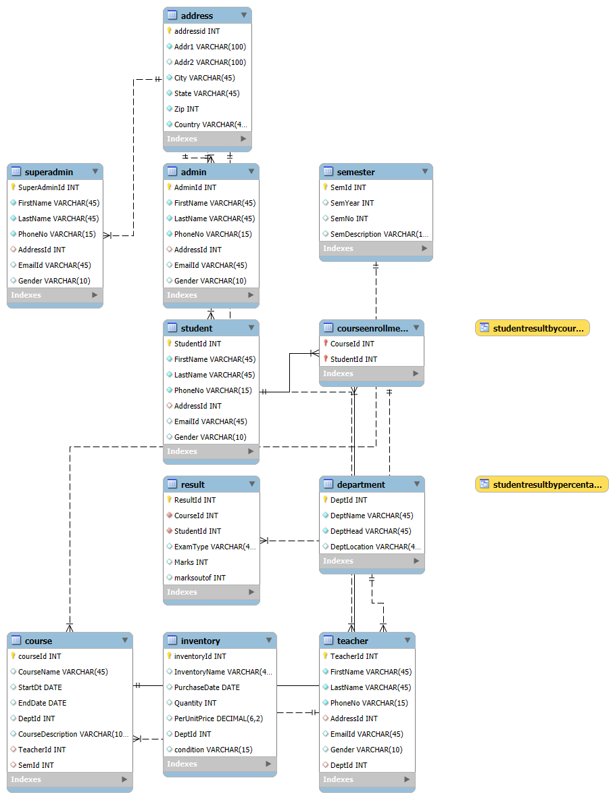

# College-Enrollment-Console-Application

## 📌 Project Overview
A console-based application built using **.NET Framework (C#)** and **MySQL** to manage college operations efficiently. The system supports multiple user roles—**Student, Teacher, Admin, and SuperAdmin**—with tailored permissions and functionalities for each role. It ensures secure user verification, structured CRUD operations, and dynamic interaction with a relational database.

---

## 🚀 Features

🔹 **Role-based Access Control**  
- Student, Teacher, Admin, and SuperAdmin workflows  
- Each role has specific permissions and functionality

🔹 **Student Module**  
- Register as a new student or log in as an existing one  
- View and update personal info  
- Enroll in available courses  
- View enrolled courses  
- Remove profile  

🔹 **Teacher Module**  
- Register or log in as teacher  
- View/update profile  
- View assigned courses  
- View enrolled students for assigned courses  
- Add student results  
- Remove profile
  
🔹 **Admin Module**  
- Secure login with Admin ID (no new registration from admin module)  
- View/update/remove Students and Teachers  
- View lists of Courses, Departments, Semesters  

🔹 **SuperAdmin Module**  
- Higher-level access  
- Register or remove Admins  
- Add/remove Departments, Courses, and Semesters  

---

## 🧑‍💻 Technologies Used

- 💻 **.NET (C#)** — Console Application  
- 🛢️ **MySQL** — Relational Database  
- 🔌 **ADO.NET** — Database Connectivity  
- 📋 **SQL** — Data Manipulation and Querying
  
---

## 🔌 ADO.NET Integration

All database operations are handled using **ADO.NET**, with:

* `MySqlConnection`
* `MySqlCommand`
* `MySqlDataReader`

This helps in understanding how .NET interacts with relational databases securely.

---

## 🗂️ Database Schema

This project uses a **relational database schema** to manage college data in a normalized and scalable structure.

### 📌 Entities & Relationships

- **Student**, **Teacher**, **Admin**, **SuperAdmin** share location data via a common `address` table.
- **Course** is linked to `Teacher`, `Semester`, and `Department`.
- **StudentCourseEnrollment** enables many-to-many relation between `Student` and `Course`.
- **Result** table stores exam scores per student per course.

### 🔄 Relationship Summary

- **One-to-Many**
  - Department → Teachers  
  - Teacher → Courses  
  - Semester → Courses  

- **Many-to-Many**
  - Student ↔ Course (via CourseEnrollment table)

---

### 🖼️ EER Diagram



> This diagram illustrates the complete database architecture including all tables, keys, and relationships.  
> File path: `assets/eer-for-college-db.png`

---

## 🎯 Project Objectives

* Learn .NET backend development with C#
* Practice role-based access logic
* Implement full CRUD operations via ADO.NET
* Understand real-world use cases like enrollment systems
* Prepare for deployment using **AWS EC2** and API integration

---

## 🙌 Acknowledgements

I would like to express my sincere gratitude to Suraj Sir for his invaluable guidance and support throughout the development of this project. His mentorship helped me understand and implement key backend and database concepts effectively.
Additionally, I am currently learning how to implement Entity Framework, which I plan to integrate into future enhancements of this application.

---

## 📧 Contact

**Developer**: Avishkar Purushottam Gaware
📫 [gawareavishkar2004@gmail.com](mailto:gawareavishkar2004@gmail.com)
🔗 [LinkedIn](https://short-link.me/18GV7)

```
